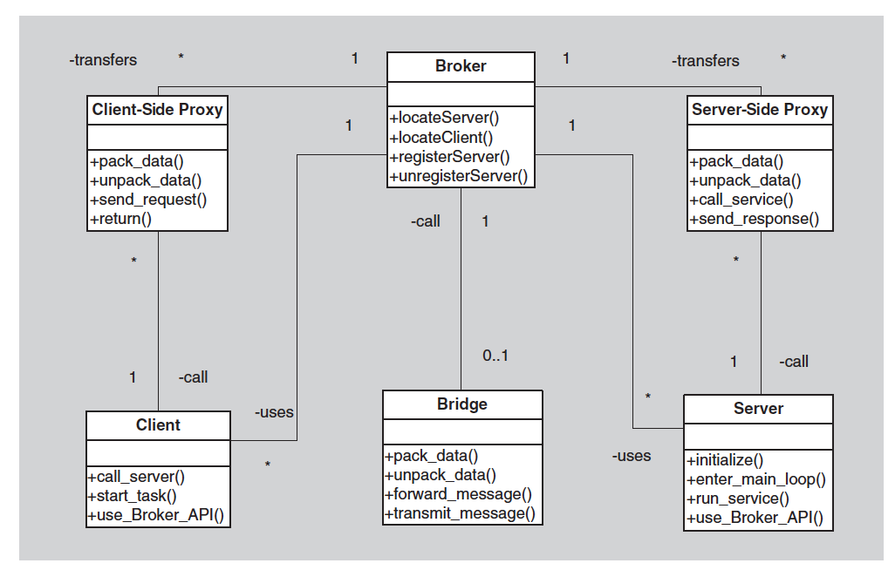

# Broker Pattern

- Component and Connector Pattern
- [Overview](../images/broker_overview.png)
- Examples
  - COBRA
  - Enterprise Java Beans (EJB)

### Diagram

### Context
- Many systems are constructed from a collection of services distrbuted across multiple servers.
- Implementing these systems is complex because you need to worry about how the system will interoperate
  - how they will connect to each other
  - how they will exchange information
  - the availability of the component services

### Problem
How do we structure distributed software so that the **service users do not need to know the nature and location of of service providers**, making it **easy to dynamically change the bindings between users and providers**?

### Solution
- The broker pattern seperates users of services (clients) from providers of services (servers) by inserting an intermediary, called a broker.
- When a client need a service, it queries the broker via a service interface.
- The broker then forward the client's service request to the server, which process the request.
- The service result is communicated from the server back to the broker, which then returns the result back to the requesting clients.

### Advantages
- Modifiability
  - Due to the tactic of use-an-intermediary
- Availability
  - Broker pattern make it easy to replace a failed server with another
- Performance
  - Broker pattern make it easy to assign work to the least-busy server

### Disadvantages
- Add complexity
  - Brokers and possibly proxies must be designed and implemented along with messaging protocols
- Add a level of indirection between client and server
  - Add latency to their communication
- Difficult to debugs
  - Involves in highly dynamic environment leading to a failure may be difficult to replicate.
- Target of security attacks
- Bottlenecks of communication
- Can be single point of failure

### Extra
- In this way, the client remain completely ignorant of the identity, location and characteristic of the server.
  - Because of this seperation, when a server become unavailable, a replacement can be make dynamically chosen by the broker.
- If a server is replaced with a different services, the broker is the only component that needs to know of this change. Client is unaffected.
- Proxies are commmonly introduced as intermediaries.
  - To help with the details of the intraction with the broker such as:
    - marshaling and unmarshaling messages.