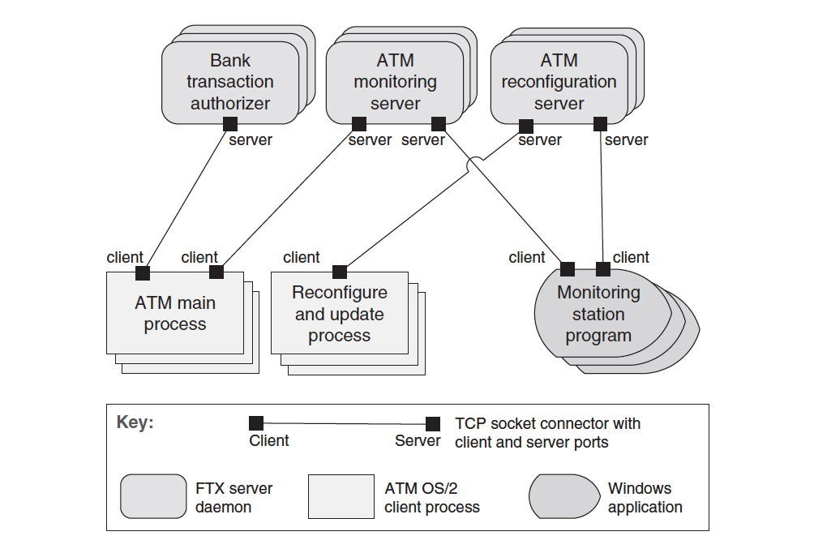

# Client-Server Pattern

- Component and Connector Pattern
- [Overview](../images/cs_overview.png)
- Examples
  - World Wide Web

### Diagram

### Context
There are **shared resources and services** that **large numbers of distributed clients wish to access**, and for which we wish to **control the access or quality of service**.

### Problem
- By managing a set of shared resources and services, we can promote modifiability and reuse, by factoring out common services and having to modify these in a single location, or a small number of locations.
- We want to improve scalability and availability by centralizing the control of these resources and services, while distributing the resource themselves accross multiple physical servers.

### Solution
- Clients interact by requesting services of servers, which provide a set of services.
- Some components may act as both clients and servers.
- There may be one central server o multiple distributed ones.
- The principal connector type for the client server pattern is a data connector driven by **request/reply** protocol used for invoking services.

### Advantages
- Seperates client application from the services they used.
- Simplifies systems by factoring out common services, which are **reusable**
- Easy to add new clients to system
  - Because servers can be accessed by any number of clients.
- Severs may be replicated to support scalability and availability

### Disadvantages
- Server can be performance bottleneck
- Server can be a single point of failure
- Decisions about **where to locate functionality** are often **complex** and **costly to change** after a system has been built.

