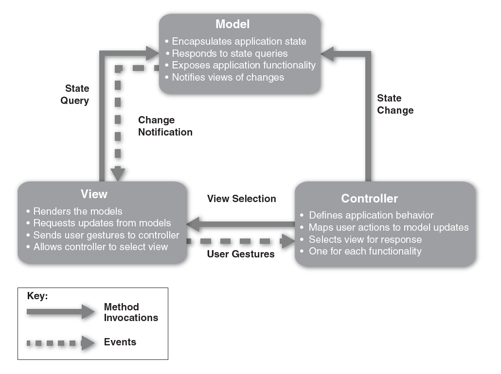

# Model View Controller Pattern

- Component and Connector Pattern
- [Overview](../images/mvc_overview.png)
- Examples
  - Java's Swing classes
  - Microsoft's ASP.NET

### Diagram

### Context
- **User interface software** is typically the most frequently modified portion of an intractive application.
- For this reason, it is important to keep modifcations to the user interface software seperate from the rest of thte system.
- User often wish to **look at data from different perspectives**, such as bar graph or pie chart.
- These representations should both reflect the current state of the data.

### Problem
- How can **user interface functionality** be kept **seperate** from application functionality and yet **still responsive to user input**, or changes in the underlying application's data?
- How can **multiple views** of the user interface be created, maintained and coordinated when the underlying application data changes?

### Solution
- The model-view-controller (MVC) pattern seperates application functionality into three kinds of components:
  - A model, which contains application's data
  - A view, which displays some portion of the underlying data and interact with the user
  - A controller, which mediates between the model and view and manages the notification of stat changes.

### Advantages
- Components are loosely coupled
  - It is easy to develop and test them in parallel
  - Changes to one have minimal impact on the others.

### Disadvantages
- The complexity may not be worth it for simple user interfaces.
- The MVC abstractions may not be a good fits for some user interface toolkits.

