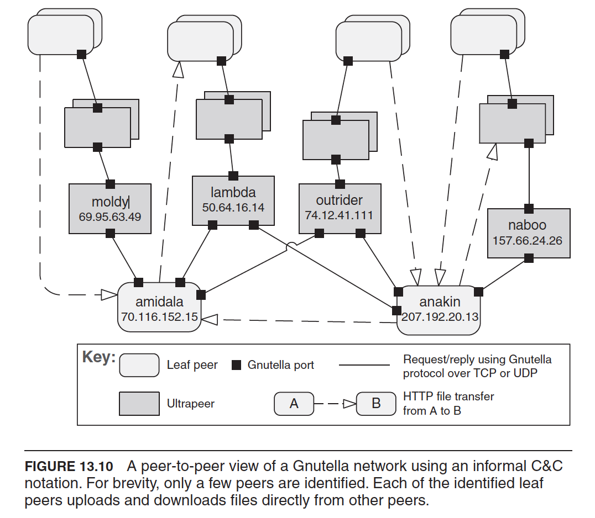

# Peer-to-Peer Pattern

- Component and Connector Pattern
- [Overview](../images/p2p_overview.png)
- Examples
  - BitTorent
  - Skype

### Diagram

### Context
Distributed computational entities --- each of which is considered **equally important** in terms of **initiating an interaction** and each of which **provides its own resource** -- need to **cooperate and collaborate** to **provide a service to a distrbuted community** of users.

### Problem
- How can a set of **"equal" distributed computational entities to be connected** to each other via a **common protocol** so that they can **organize and share** their **services** with high availability and scalability?

### Solution
- In the P2P pattern, components directly interact as peers.
- All peers are "equal" and no peer or group of peers can be cirtical for the health of the system.
- Peer-to-peer communication is typically request/reply interaction.
- Any component can interact with any other component by requesting its services.
- Each peer component:
  - is both a client and a server.
  - provides and consumes similar services
  - uses the same protocol
- May have specialized peer nodes (supernodes) to have indexing or routing capibilities and allow a regular peer's serach to reach a larger number of peers.

### Advantages
- Peer can be aded and removed from the peer-to-peer network with no significant impact
  - resulting in **great scalability** for the whole system
  - provides **flexibility** to deploying the system across a  highly distributed platform.
- Improved availability
- Performance advantages
  - The load on any given peer components acting as a server is reduced.
  - Responsbilities that might have required more server capacity and infrastructure to support it are distributed

### Disadvantages
- Decentralized, hence, more complex to:
  - Managing security
  - Data consistency
  - Data and Service availability
  - Backup
  - Recovery
- Difficult to provide guarantees
  - Peers come and go
- Small peer-to-peer systems may not be able to consistently achieve quality goals such as performance and availability

# Peer to Peer