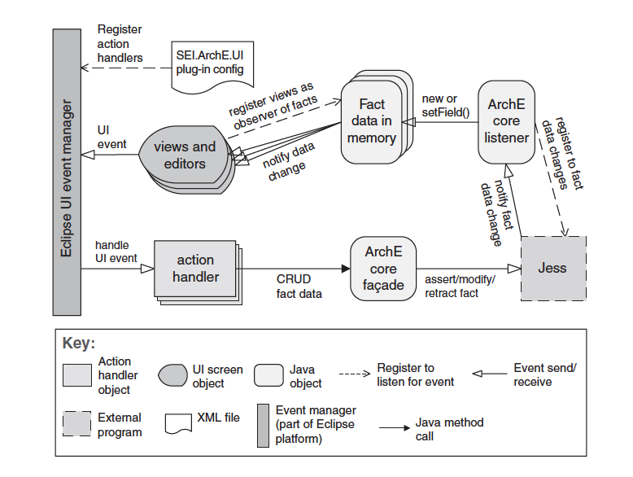

# Peer-to-Peer Pattern

- Component and Connector Pattern
- [Overview](../images/ps_overview.png)

### Diagram

### Context
There are anumber of **independent producers** and **consumers** of data that must interact. The **precise number** and **nature** of the data producers and consumers are **not predetermined or fixed**, nor is the **data** they **share**.

### Problem
How can we create integration mechanisms that support **the ability** to **transmit messages among the producers and consumers** in such a way that they are **unaware** of each other's **identity**, or potentially even their **existence**?

### Solution
- In the publish-subscribe pattern, components interact via annouced messages or events.
- Components may subscribe to a set of events.
- It is the joib of the publish-subscribe runtime infrastructure to make sure that each published event is delivered to all subscribers of that event.
- Main form of connector is an **event bus**
- Publisher components place events on the bus by annoucing them.
- The connector delivers those events to subscriber components that have registered interest in those event.
- Any component can be both a publisher or subscriber.

### Advantages
- *Didn't mentioned.*

### Disadvantages
- Adds a layer of indrection between senders and receivers
  - Negative effect on latency and potentially scalability
- Uncertainty in message delivery times
  - Not suitable for hard real-time system
- Less control over ordering of messages, and the delivery of messages is not guranteed.
Publish-subscribe pattern inherits the strengths and weaknesses
of the broker pattern
