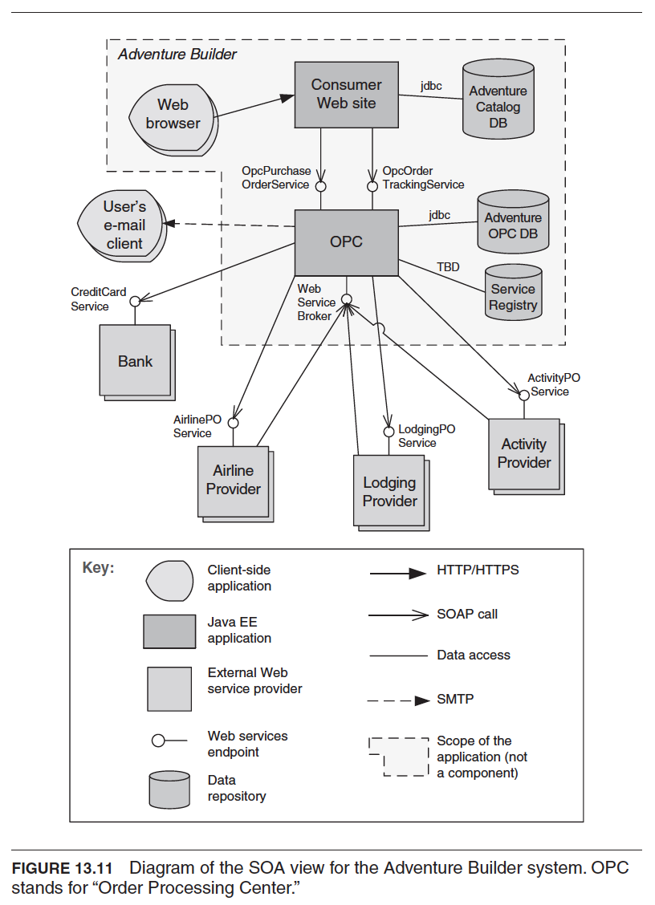

# Service-Oriented Architecture Pattern

- Component and Connector Pattern
- [Overview](../images/soa_overview.png)

### Diagram

### Context
A **number of services** are offered by service **providers** and consumed by service **consumers**. Service consumers need to be able to **understand and use these services without any detailed knowledge of their implementation**.

### Problem
- How can we support **interoperability of distributed components** running on **different platforms** and written in **different implementation languages**, provided by different organizations, and **distributed across the Internet**?
- How can we **locate services** and **combine** (and dynamically recombine) **them into meaningful coalitions** while achieving reasonable performance, security, and availability?

### Solution
- The SOA pattern describes a collection of distrbuted components that provide and/or consume services.
- In an SOA, service provider components and service consumer components can user **different implementation languages and platforms**.
- Services are largely standalone:
  - service provider and service consumers are usaully deployed independently.
     - often belongs to different systems or different organizations.
- Components have interfaces that describe:
  - the services they request from others
  - the services that they provide
- Components achieve their computation by requesting services from one another.

### Basic types of connectors used in SOA:

#### SOAP
- The standard protocol for communication in the web services technology.
- Service consumers and providers interact by exchanging request/reply XML messages typically on top of HTTP.

#### Representational State Transfer (REST)
- A service consumer sends non-blocking HTTP requests.
- The requests rely on the four basic HTTP commands (POST, GET, PUT, DELETE) to tell the service provider to create, retrieve, update and delete a resource.

#### Asynchronous messaging
- a "fire and forget" information exchange.
- Participants do not have to wait for acknowledgement of receipt
  - because the infrastructure is assumed to have delivered the message sucessfully.
- The messaging connector can be point-to-pint or publish-subscribe.

### Advantages
- Interoperability
  - Service providers and consumers may run on different platforms.
- Special SOA components such as registry ot the ESB (Enterprise service bus) allows dynamic reconfiguration
  - useful when need to replace or add versions of components with no system interruption

### Disadvantages
- Complex to design and implement
- Performance overhead of the middleware
  - that is interposed between services and clients
- Lack of performance guarantees
  - Because services are shared and not under controll of requester
- You do not control the evolution of the services you used
  - May have to endure **high** and **unplanned-for maintainence costs**.