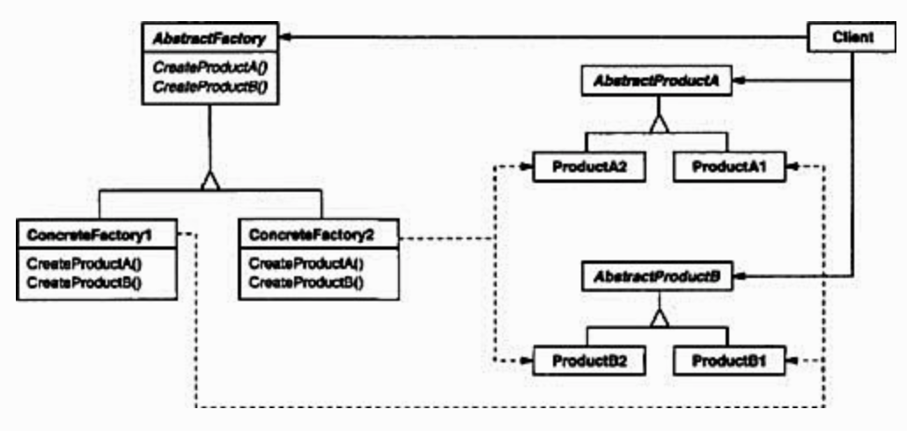

# Abstract Factory

### Intent
Provide an interface for creating families of related or dependent objects without specifying their concrete classes.

### Applicability
Use the Abstract Factory pattern when
- a system should be independent of how its products are created, composed and represented.
- a system should be configured with one of multiple families of products
- a family of related product objects is designed to used together, and you need to enforce this constraint
- you want to provide a class library of products, and you want to reveal just their interfaces

### Structure



### Participants
- **AbstractFactory**
  - declares an interface for operations that create abstract product objects
- **ConcreteFactory**
  - implements the operations to create concrete product objects.
- **AbstractProduct**
  - declares an interface for a type of product object
- **ConcreteProduct**
  - define a product object to be created by the corresponding concrete factory
  - implement the `AbstractProduct` interface
- **Client**
  - uses only interfaces declared by the `AbstractFactory` and `AbstractProduct`

### Code

#### Creating `AbstractProduct`
In `Shape.java`:
```java
public interface Shape {
  void draw();
}
```

In `Color.java`:
```java
public interface Color {
  void fill();
}
```

#### Creating `ConcreteProduct`
In `Rectangle.java`:
```java
public class Rectangle implements Shape {
  @Override
  public void draw() {
    System.out.println("Draw rectangle.");
  }
}
```

In `Square.java`:
```java
public class Square implements Shape {
  @Override
  public void draw() {
    System.out.println("Draw square.");
  }
}
```

In `Red.java`:
```java
public class Red implements Color {
  @Override
  public void fill() {
    System.out.println("Fill red.");
  }
}
```

In `Blue.java`:
```java
public class Blue implements Color {
  @Override
  public void fill() {
    System.out.println("Fill blue.");
  }
}
```

#### Creating `AbstractFactory`
In `AbstractFactory.java`:
```java
public abstract class AbstractFactory {
  abstract Color getColor(String color);
  abstract Shape getShape(String shape);
}
```

#### Creating `ConcreteFactory`

In `ShapeFactory.java`:
```java
public class ShapeFactory extends AbstractFactory {
  @Override
  public Shape getShape(String shapeType) {
    if (shapeType == null) { return null; }

    if (shapeType.equalsIgnoreCase("RECTANGLE")) {
      return new Rectangle();
    } else if (shapeType.equalsIgnoreCase("SQUARE")) {
      return new Square();
    }

    return null;
  }

  @Override
  public Color getColor(String color) {
    return null;
  }
}
```

In `ColorFactory.java`:
```java
public class ColorFactory extends AbstractFactory {
  @Override
  public Shape getShape(String shapeType) {
    return null;
  }

  @Override
  public Color getColor(String color) {
    if (color == null) { return null; }

    if (color.equalsIgnoreCase("RED")) {
      return new Red();
    } else if (color.equalsIgnoreCase("BLUE")) {
      return new Blue();
    }

    return null;
  }
}
```
#### Creating `Client`
```java
public class Client {
  public static void main(String[] args) {
    AbstractFactory factory = new ColorFactory();

    factory.getColor("RED").fill();
    factory.getColor("BLUE").fill();

    factory = new ShapeFactory();
    factory.getShape("SQUARE").draw();
    factory.getShape("RECTANGLE").draw();
  }
}
```

Run the code by:
```
cd design_pattern/code/abstract_factory && javac *.java && java Client
```

#### Output
```
Fill red.
Fill blue.
Draw square.
Draw rectangle.
```

### Consequences

#### Benefits
1. **It isolates concrete classes**

The Abstract Factory pattern helps you control the classes of objects that an application creates. Because a factory encapsulates the responsibility and process of creating product objects, it isolates clients from implementation classes. Client manipulate instances through their abstract iterfaces. Product class names are isolated in the implementation of the concrete factory; they do not appear in client code.

2. **It makes exchanging product families easy**

The class of a concrete factory appears only once in an application, that is, where it's instantiated. This makes it easy to change the concrete facotry an application uses.

3. **It promotes consistency among products**

When product objects in a family are designed to work togehter, it's important that an application use object from only one family at a time. `AbstractFactory` makes this easy to enforce.

#### Liabilities
1. **Supporting new kinds of products is difficult**

Extending abstact factories to produce new kinds of Products isn't easy. That's because the `AbstractFactory` interface fixed the set of products that can be created. Supporting new kinds of products requires extending the factory interface, which invovles changing `AbstractFactory` class and all of its subclasses.

