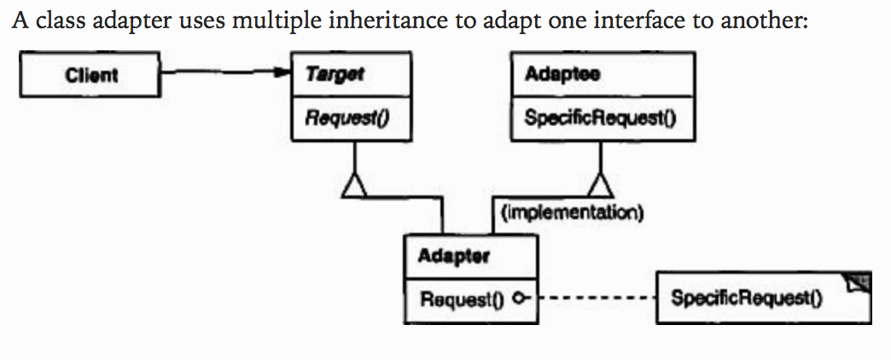
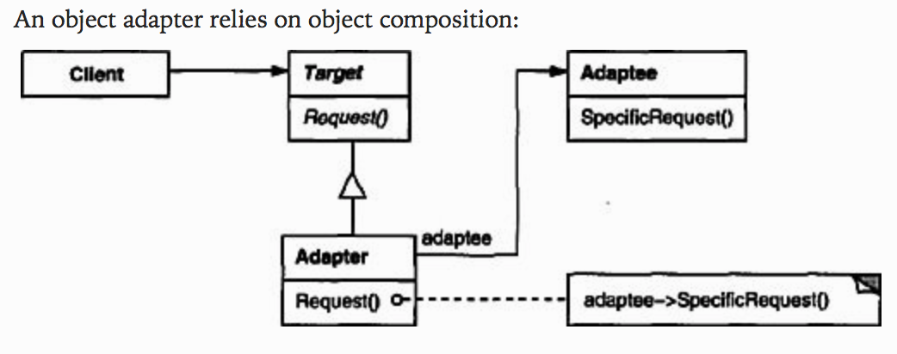

# Adapter
Structural pattern.

### Intent
Convert the interface of a class into another interface clients expect. Adapter lets classes work together that couldn't otherwise because of incompatible interfaces.

### Applicability
Use the Adapter pattern when
- you want to use an existing class, and its interface does not match the one you need.
- you want to create a reusable class that cooperates with unrelated or unforseen classes, that is, classes that don't necessarily have compatible interfaces.
- *(object adapter only)* you need to use several existing subclasses, but it's impratical to adapt their interface by subclassing every one. An object adapter can adapt the interface of its parent class.

### Structure




### Participants
- **Target**
  - defines the domain specific interface that `Client` uses.
- **Client**
  - collaborates with objects conforming to the `Target` interface.
- **Adaptee**
  - define an existing interface that needs adapting.
- **Adapter**
  - adapts the interface of `Adaptee` to the `Target` interface.

### Code
Below are Class Adapter pattern.

#### Creating `Adaptee`
In `Socket.java`:
```java
public class Socket {
  public int getVolt() {
    return 120;
  }
}
```

#### Creating `Target`
In `Adapter.java`:
```java
public interface Adapter {
  public void get120Volt();
  public void get12Volt();
  public void get3Volt();
}
```

#### Creating `Adapter`
In `SocketAdapter.java`:
```java
public class SocketAdapter extends Socket implements Adapter {

  public void get120Volt() {
    System.out.println("Volt: " + getVolt());
  }

  public void get12Volt() {
    System.out.println("Volt: " + getVolt() / 10);
  }

  public void get3Volt() {
    System.out.println("Volt: " + getVolt() / 40);
  }
}
```

#### Creating `Client`
In `Demo.java`:
```java
public class Demo {
  public static void main(String[] args) {
    Adapter adapter = new SocketAdapter();

    adapter.get120Volt();
    adapter.get12Volt();
    adapter.get3Volt();
  }
}
```

Run the code by:
```
cd design_pattern/code/adapter && javac *.java && java Demo
```

#### Output
```
Volt: 120
Volt: 12
Volt: 3
```

### Consequences
Class and object adapters have different trade-offs. A class adapter
  -  adapts `Adaptee` to `Target` by committing to a concrete `Adaptee` class. As a consequence, a class adapter won't work when we want to adapt a class and all its subclasses.
  - lets `Adapter` override some of `Adaptee`'s behavior, since `Adapter` is a subclass of `Adaptee`.
  - introduces only one object, and no additional pointer indirection is needed to get to the adaptee.

An object adapter
  - lets a single `Adapter` work with many `Adaptee`s -- that is, the `Adaptee` itself and all of its subclasses (if any). The `Adapter` can also add functionality to all `Adaptee`s at once.
  - makes it harder to override `Adaptee` behavior. It will require subclasssing `Adaptee` and making `Adapter` refer to the subclass rather than the `Adaptee` itself.