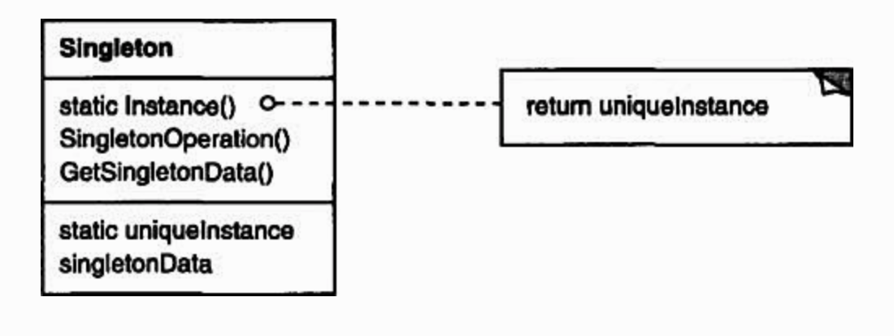

# Adapter

### Intent
Provide an interface for creating families of related or dependent objects without specifying their concrete classes.

### Applicability

### Structure



### Participants

### Code

Run the code by:
```
cd design_pattern/code/abstract_factory && javac *.java && java Demo
```

### Consequences