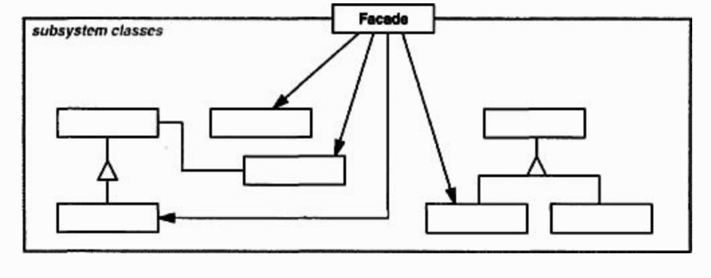

# Facade
Structural pattern.

### Intent
Provide a unified interface to a set of itnerfaces in a subsystem. Facade define a higher-level interface that makes the subsystem easier to use.

### Applicability
Use the Facade pattern when
- you want to provide a simple interface to complex subsystem. A facade can provide a simple default view of the subsystem that is good enough for more clients.
- there are many dependencies between clients and the implementation classes of an abstraction. Introduce a facade to decouple the subsystem from clients and other subsystems, thereby promoting subsystem independence and portability.
- you want to layer your subsystems. Use a facade to define an entry point for each subsystem level. If subsystems are dependent, then you can simplify the dependencies between them by making them communicate with each other solely through ftheir facades.


### Structure



### Participants
- **Facade**
  - know which subsystem classes are responsible for a request.
  - delegates client requests to appropriate subsystem objects.
- **subsystem classes**
  - implement subsystem functionality
  - handle work assigned by `Facade` object.
  - have no knowledge of the facade; that is, they keep no reference to it.

### Code

#### Creating subsystem classes
In `Rectangle.java`:
```java
public class Rectangle {
  public void draw() {
    System.out.println("Draw Rectangle.");
  }
}
```

In `Square.java`:
```java
public class Square {
  public void draw() {
    System.out.println("Draw Square.");
  }
}
```

#### Creating `Facade`
In `ShapeMaker.java`:
```java
public class ShapeMaker {
  private Rectangle rectangle;
  private Square square;

  public ShapeMaker() {
    rectangle = new Rectangle();
    square = new Square();
  }

  public void drawRectangle() {
    rectangle.draw();
  }

  public void drawSquare() {
    square.draw();
  }
}
```

#### Creating `Demo`
In `Demo.java`:
```java
public class Demo {
  public static void main(String[] args) {
    ShapeMaker maker = new ShapeMaker();

    maker.drawRectangle();
    maker.drawSquare();
  }
}
```

Run the code by:
```
cd design_pattern/code/facade && javac *.java && java Demo
```

#### Output
```
Draw Rectangle.
Draw Square.
```

### Consequences
The Facade pattern offers the following benefits:

1. It shield clients from subsystem components, thereby **reducing the number** of objects that client deal with and making the subsystem easier to use.

2. It promotes weak coupling between thes subsystem and its client. Weak coupling lets you vary the components of the subsystem without affecting its clients. They can eliminate complex or circular dependencies.

3. Reducing compilation dependencies. Save time by minimizing recompilation.

4. It doesn't prevent applications from using subsystem classes if they need to. Thus, you can choose between ease of use and generality.