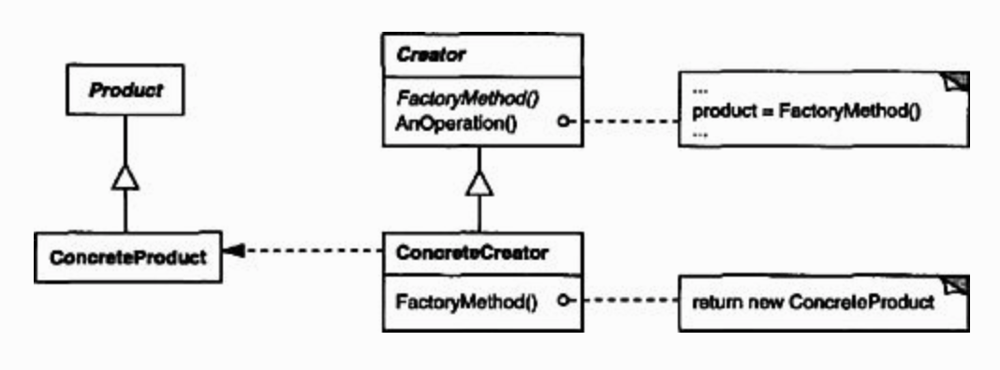

# Factory Pattern

### Intent
Define an interface for creating an object, but let subclasses decide which class to instantiate. Factory Method lets a class defer instantiation to subclasses

### Applicability
Use the Factory Method pattern when
- a class can't anticipate the class of objects it must create
- a class wants its subclasses to specify the objects it creates
- classes delegate responsibility to one of several helper subclasses, and you want to localize the knowledge of which helper subclass is the delegate

### Structure



### Participants
- **Product**
  - define the interface of objects the factory method creates.
- **ConcreteProduct**
  - implements the `Product` interface
- **Creator**
  - declares the factory method, which return an object of type `Product`. `Creator` may also define default implementation of the factory method that returns a default `ConcreteProduct` object.
- **ConcreteCreator**
  - overrides the factory method to return an instance of a `ConcreteProduct`

### Code

#### Creating `AbstractProduct`
In `Shape.java`:
```java
public interface Shape {
  void draw();
}
```

#### Creating `ConcreteProduct`
In `Rectangle.java`:
```java
public class Rectangle implements Shape {
  @Override
  public void draw() {
    System.out.println("Draw rectangle.");
  }
}
```

In `Square.java`:
```java
public class Square implements Shape {
  @Override
  public void draw() {
    System.out.println("Draw square.");
  }
}
```

#### Creating `ConcreteFactory`

In `ShapeFactory.java`:
```java
public class ShapeFactory {
  public Shape getShape(String shapeType) {
    if (shapeType == null) { return null; }

    if (shapeType.equalsIgnoreCase("RECTANGLE")) {
      return new Rectangle();
    } else if (shapeType.equalsIgnoreCase("SQUARE")) {
      return new Square();
    }

    return null;
  }
}
```

#### Creating `Demo`
```java
public class Demo {
  public static void main(String[] args) {
    ShapeFactory factory = new ShapeFactory();

    factory.getShape("SQUARE").draw();
    factory.getShape("RECTANGLE").draw();
  }
}
```

Run the code by:
```
cd design_pattern/code/factory_pattern && javac *.java && java Demo
```

### Consequences

1. **Eliminates the need to bind application-specific classes**

The code only deals with the `Product` interface; therefore it can work with any user-defined `ConcreteProduct` classes

2. **Clients might have to subclass Creator class just to create a particular ConcreteProduct**

