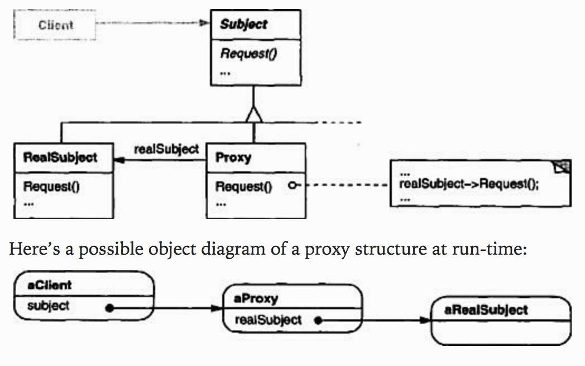

# Proxy

### Intent
Provide a surrogate or placeholder for another object to control access to it.

### Applicability
Proxy is applicable whenever there is a need for a more versatile or sophisticated reference to an object than a simple pointer. Here are several common situations in which Proxy pattern is applicable:

1. A **remote proxy** provides a local representative for an object in a different address space.
2. A **virtual proxy** creates expensive objects on demand.
3. A **protection proxy** control access to the original object. Protection proxies are useful when objects have different access right.
4. A **smart reference** is a replacement for a bare pointer that performs additional actions when an object is accessed.

### Structure



### Participants
- **Proxy**
  - maintains a reference that lets the proxy access the real subject. Proxy may refer to a `Subject` if the `RealSubject` and `Subject` interfaces are the same.
  - provide an inteface identical to `Subject`'s so that a proxy can by substituted for the real subject.
  - control access to the real subject and maybe responsible for creating or deleting it.
  - other responsibilities depend on the kind of proxy:
    - *remote proxies* are responsible for enchoding a request and its arguments and for sending the encoded request to the real subject in a different address space.
    - *virtual proxies* may cache additional information about the real subject so that they can postpone accessing it.
    - *protection proxies* check the caller has the access permission required to perform a request.
- **Subject**
  - defines the common interface for `RealSubject` and `Proxy` so that a `Proxy` can be used anywhere a `RealSubject` is expected.
- **RealSubject**
  - define the real object that the proxy represents.

### Code
This code illustrate the use of virtual proxies. The operation of `loadFromDisk` is assumed to be expensive.

#### Creating `Subject`
In `Image.java`:
```java
public interface Image {
  void display();
}
```

#### Creating `RealSubject`
In `RealImage.java`:
```java
public class RealImage implements Image {
  private String fileName;

  public RealImage(String fileName) {
    this.fileName = fileName;
    loadFromDisk(fileName);
  }

  @Override
  public void display() {
    System.out.println("Display image from " + fileName);
  }

  private void loadFromDisk(String fileName) {
    System.out.println("Loading image from " + fileName);
  }
}
```

#### Creating `Proxy`
In `ProxyImage.java`:
```java
public class ProxyImage implements Image {

  private RealImage realImage;
  private String fileName;

  public ProxyImage(String fileName) {
    this.fileName = fileName;
  }

  @Override
  public void display() {
    if (realImage == null) {
      realImage = new RealImage(fileName);
    }

    realImage.display();
  }
}
```

#### Creating Demo
In `Demo.java`:
```java
public class Demo {
  public static void main(String[] args) {
    Image image = new ProxyImage("test.jpg");

    image.display();
    System.out.println();

    // Image will not be loaded from disk again
    image.display();
  }
}
```
Run the code by:
```
cd design_pattern/code/proxy && javac *.java && java Demo
```

#### Output
```
Loading image from test.jpg
Display image from test.jpg

Display image from test.jpg
```

### Consequences
The Proxy pattern introduces a level of indirection when accessing an object. The additional indirection has many uses, depending on the kind of proxy:

1. A remote proxy can **hide the fact** that an object resides in a different address space.
2. A virtual proxy can **perform optimizations** such as creating an object on demand.
3. Both protection proxies and smart reference **allow additional housekeeping** tasks when an object is accessed.

There's another optimization the Proxy pattern can hide from the client. It's called **copy-on-write** *(which means only copy the object if it is modified)*.
- related to creation on demand.
- Copying a large and complicated object can be expensive.
- If the copy is never modified, then there's no need to copy.
- By using a proxy to postpone the copying process, we ensure that we pay the price of copying the object only if it's modified.

Copy-on-write **reduce the cost of copying heavyweight subjects** significantly.